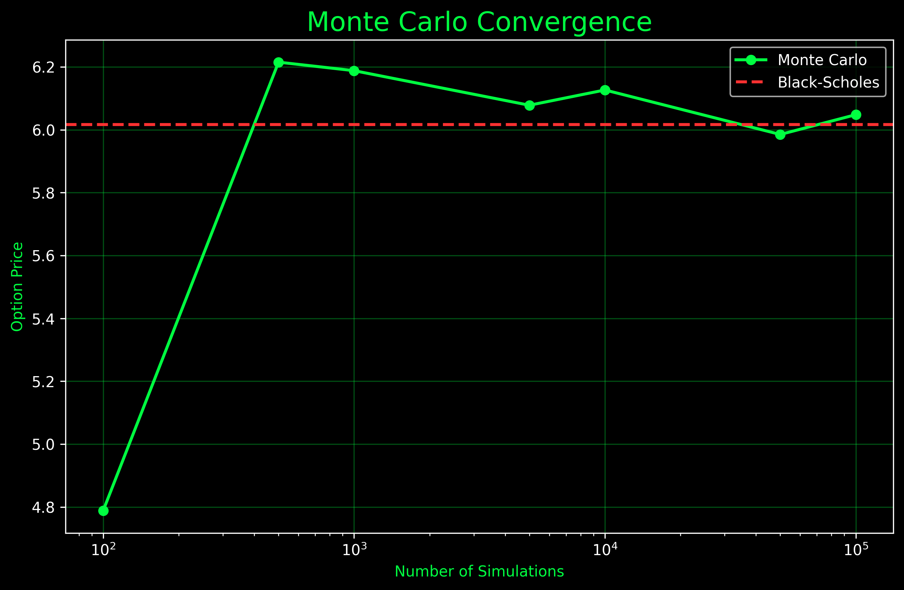
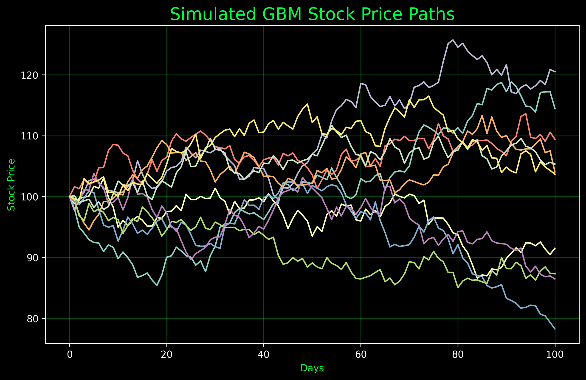

# Monte Carlo Option Pricing

A quantitative finance project that prices a European Call Option using Monte Carlo Simulation and validates the result against the Black-Scholes analytical solution.

The project models stock price movements using Geometric Brownian Motion (GBM), applies risk-neutral pricing, discounts expected future payoffs to present value, and demonstrates convergence toward the Black-Scholes price as the number of simulations increases.

---

## Features

- Geometric Brownian Motion (GBM) stock price simulation
- Monte Carlo option pricing engine
- European Call Option payoff calculation
- Risk-neutral pricing framework
- Present value discounting
- Black-Scholes analytical pricing model
- Convergence analysis
- Stock price path visualization

---

## Concepts Implemented

### Geometric Brownian Motion (GBM)

Stock prices are simulated using:

```
dS = μSdt + σSdW
```

where:

- μ = drift
- σ = volatility
- dW = random shock

---

### Monte Carlo Simulation

Thousands of possible future stock price paths are generated.

The option payoff is calculated for each simulation and averaged to estimate the expected option value.

---

### Risk-Neutral Pricing

Under the risk-neutral framework, the expected growth rate of the stock is assumed to be the risk-free rate.

This allows future expected payoffs to be discounted back to present value.

---

### Black-Scholes Model

The Black-Scholes formula provides the theoretical price of a European Call Option.

The Monte Carlo estimate is compared against this benchmark for validation.

---

## Results

Example Output:

```
Monte Carlo Price: 6.01
Black-Scholes Price: 6.02
Difference: 0.0001
```

The close agreement between the two methods validates the Monte Carlo implementation.

---

## Convergence Analysis

As the number of simulations increases, the Monte Carlo estimate converges toward the Black-Scholes price.



This behavior is consistent with the Law of Large Numbers and demonstrates that simulation accuracy improves with larger sample sizes.

---

## Simulated Stock Price Paths

Sample stock price paths generated using Geometric Brownian Motion.



Each line represents one possible future evolution of the stock under the model assumptions.

---

## Project Structure

```text
MonteCarloOptionPricing/

├── main.py
├── monte_carlo.py
├── black_scholes.py
├── requirements.txt
├── README.md
└── images/
    ├── convergence.png
    └── stock_paths.png
```

---

## Installation

```bash
git clone <repository-url>

cd MonteCarloOptionPricing

pip install -r requirements.txt
```

---

## Run

```bash
python3 main.py
```

---

## Key Learnings

Through this project I learned:

- Geometric Brownian Motion
- Monte Carlo Simulation
- Option Payoffs
- Risk-Neutral Pricing
- Present Value Discounting
- Black-Scholes Pricing
- Convergence Analysis
- Quantitative Finance Modeling in Python

---

## Future Improvements

Potential extensions include:

- Confidence Intervals
- Variance Reduction Techniques
- Greeks Calculation
- American Option Pricing
- Exotic Options
- Portfolio-Level Simulations

---